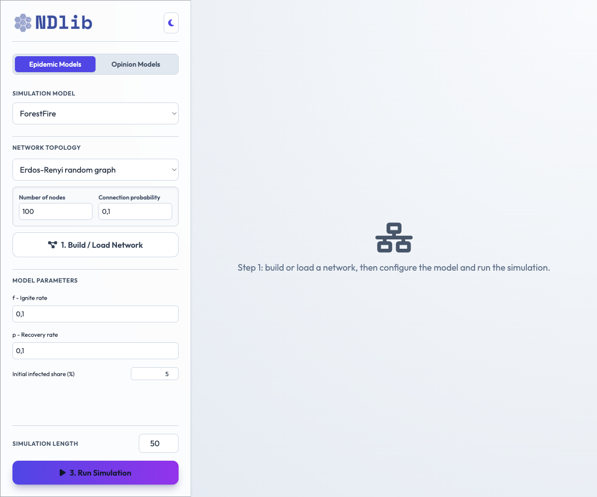
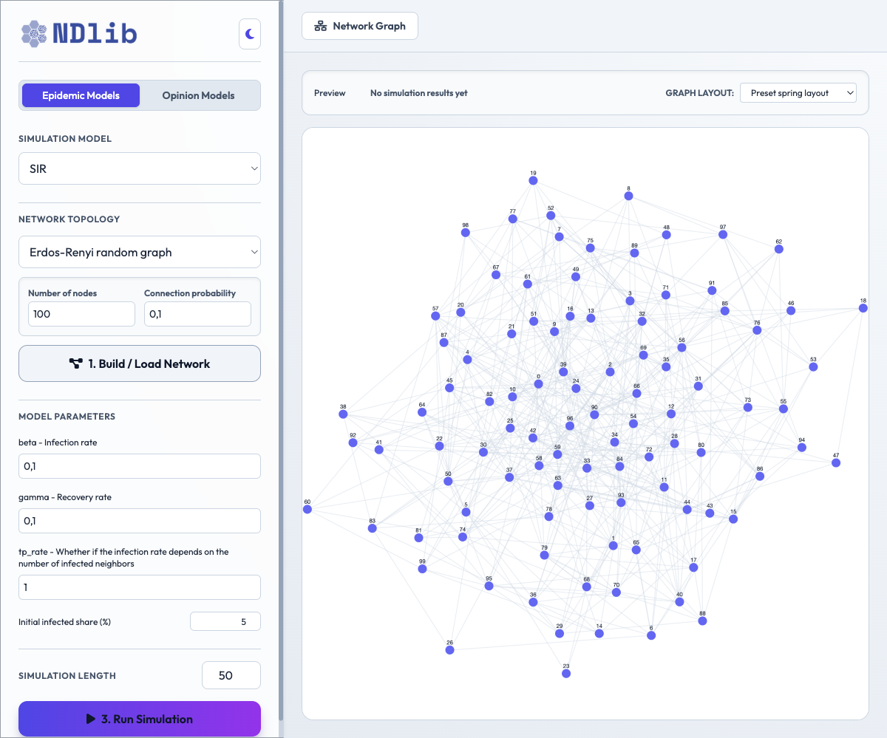
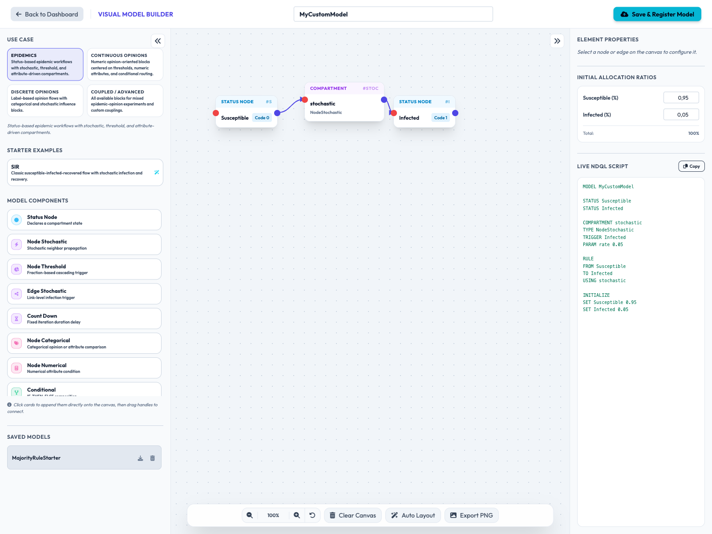
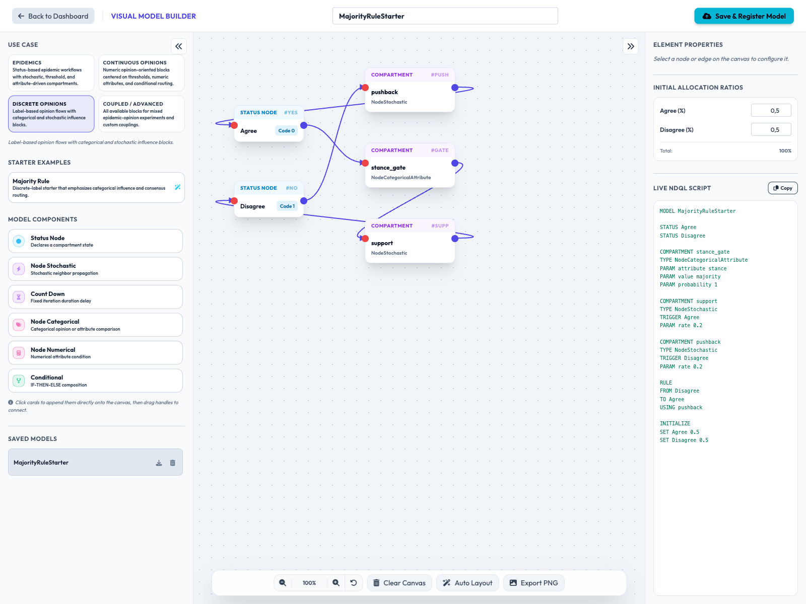

********************
Interactive Dashboard
********************

NDlib ships with a browser-based dashboard service that lets you build a graph, configure a model, and run a simulation from a single interface.

The dashboard is intended for quick experimentation, classroom use, and exploratory analysis when you want to compare multiple models without writing code.

Main features
=============

- Generate synthetic graphs or upload a custom network.
- Inspect epidemic and opinion models through a three-step workflow.
- Configure model parameters directly from the UI.
- Select initial epidemic seeds by clicking nodes in the graph preview.
- Use community-aware graph layouts to highlight structural groups.
- Visualize trends, opinion evolution, prevalence, and network state.
- Build custom models with a use-case-aware visual editor that filters the available blocks by model family.
- Start from example templates for ``SIR``, ``Algorithmic Bias``, ``Majority Rule``, and a coupled starter layout.

Quick start
===========

From the repository root, launch the service with:

.. code-block:: bash

   python ndlib/dashboard/server.py

If the package is installed, the same service is also exposed as:

.. code-block:: bash

   ndlib-dashboard

Then open the local URL printed by the server in your browser.

The standard workflow is:

1. Build or load a network.
2. Configure the model parameters.
3. Run the simulation and inspect the plots and graph view.

Example usage
=============

Generate a small graph and simulate an epidemic model:

.. code-block:: bash

   python ndlib/dashboard/server.py

or, if installed as a command:

.. code-block:: bash

   ndlib-dashboard

In the dashboard:

1. Choose an epidemic model such as ``SIR``.
2. Set the graph topology and the model parameters.
3. Click ``Build / Load Network``.
4. Click ``Run Simulation``.
5. Use the network tab to inspect the graph at each step.

For epidemic models, you can seed the outbreak by clicking nodes in the preview graph. If no nodes are selected, the dashboard uses the ``Initial infected share (%)`` field instead.

Opinion-only custom models now initialize their own status ratios directly, so they do not require an epidemic ``Infected`` class.

Visual Model Builder
====================

The dashboard includes an interactive visual programming canvas to build custom compartmental models. It now separates the builder into use cases so that the palette only exposes blocks that are meaningful for the selected family.

The full block guide is documented in :doc:`network_builder_blocks`, which lists the current builder vocabulary and the NDQL emitted by the builder.

The supported use cases are:

* **Epidemics**: compartmental models such as ``SIR`` and variants based on infection, threshold, and attribute-driven conditions.
* **Continuous Opinions**: numeric-opinion workflows centered on continuous variables, numerical checks, and conditional routing.
* **Discrete Opinions**: label-based opinion workflows that favor categorical and stochastic influence blocks.
* **Coupled / Advanced**: a mixed workspace that exposes all blocks for more expressive custom experiments.

Each use case also provides starter templates so the canvas can be populated with a working example in one click.

Available Blocks
----------------

The builder palette is filtered per use case, but the available blocks are:

* **Status Node**: declares a compartment state.
* **Node Stochastic**: propagates a state change stochastically if neighboring nodes match a status.
* **Node Threshold**: activates a change when the triggering fraction exceeds a threshold.
* **Edge Stochastic**: evaluates link-level propagation conditions.
* **Count Down**: implements fixed iteration-based delays.
* **Node Categorical Attribute**: checks categorical node properties.
* **Node Numerical Attribute**: performs numerical checks on node attributes.
* **Node Numerical Variable**: checks a numeric node variable or opinion-like quantity.
* **Conditional Composition**: composes a condition with true/false branches.

The right-hand property panel adapts to the selected block. Parameters are edited in place and the live NDQL preview updates immediately.

Starter templates
-----------------

The builder includes ready-made templates that can be loaded from the sidebar:

* ``SIR`` for epidemics.
* ``Algorithmic Bias`` for continuous-opinion style layouts.
* ``Majority Rule`` for discrete-opinion style layouts.
* ``Coupled Starter`` for mixed epidemic-opinion experiments.

Step-by-Step Instructions
-------------------------

1. Open the Visual Model Builder canvas from the top navbar.
2. Pick a use case in the left sidebar.
3. Optionally load one of the starter templates.
4. Clear the canvas or start modifying the loaded layout.
5. Click components in the left sidebar to add them to the canvas.
6. Drag node cards to position them.
7. Draw connections by dragging from the blue ``out`` handle on the right of any node/compartment to:
   * The purple ``in`` handle on the left of target nodes.
   * Named sub-port handles (``cond``, ``true``, ``false``) on a ``ConditionalComposition`` block.
8. Select any card to configure its parameters in the right sidebar.
9. Enter a unique model name, then click ``Save & Register Model``.
10. The compiled model will immediately be listed under the **Custom Models** tab in the dashboard side panel, ready to simulate.
11. Use the ``Copy`` button above the NDQL preview to copy the generated script text.
12. Use the download button next to a saved model to retrieve the generated Python source.

Current behavior notes
----------------------

* Custom opinion starters initialize from the statuses declared in the builder, so they no longer inherit epidemic-only ``Infected`` validation.
* The builder palettes are filtered by use case to reduce invalid block combinations.
* The network graph is shown by default only for sufficiently small networks, while larger graphs keep the interface focused on simulation controls and plots.

Screenshots
===========

Configuration view:

   Dashboard configuration view with graph, model, and simulation controls.

Network view:

   Dashboard network tab with the preview and layout controls.

Visual Model Builder view:

   The flowchart canvas for building custom compartmental models.

Builder use cases and starter templates:

   The use-case-aware builder sidebar with filtered blocks and starter templates.

Notes
=====

The dashboard is a lightweight local service and is meant to complement, not replace, the Python API and the documented visualization modules.

For the full implementation-oriented builder guide, see ``docs/visual_model_builder_opinion_epidemic_guide.md``.
