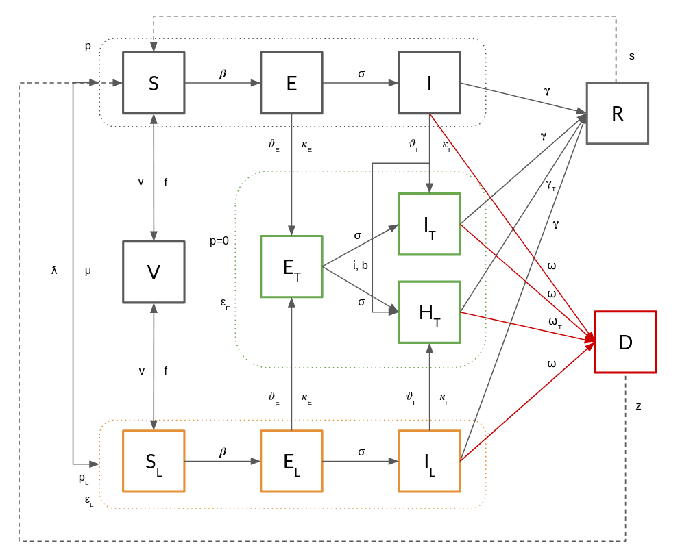

*****
UTLDR
*****

 
The UTLDR model [#]_ describe a complex framework allowing to extend SEIR/SEIS to incorporate medical and non medical interventions.
The acronym summarizes the five macro statuses an agent can be involved into:

- **U** ndetected
- **T** tested
- **L** ocked
- **D** ead
- **R** ecovered

The **U** macro status follows the same rules of a classic SEIR(S) model and model the general epidemic evolution when no intervention is established.

The **T** macro status implements Testing (e.g., identification of exposed/infected agents) and model different classes of response (e.g., quarantine, hospitalization, ICU ospitalization).

The **L** macro status implements Lockdowns (that can be fine tuned on node attributes) and, as such, social contacts reduction.

Finally, the **R** and **D** statuses model the final outcome of an infection (either death or recovery) and are sensible to the various paths for reaching them.

Moreover, UTLDR allows also to include (effective/uneffective) vaccination effects.

   UTLDR schema: **U** black statuses, **T** green statuses, **L** orange statuses.

--------
Statuses
--------

During the simulation a node can experience the following statuses:

===========================================  ====
Name                                         Code
===========================================  ====
Susceptible                                  0
Infected                                     1
Exposed		                                 2
Recovered                                    3
Identified Exposed                           4
Hospitalized Mild conditions                 5
Hospitalized in ICU                          6
Hospitalized in Severe conditions (not ICU)  7
Lockdown Susceptible                         8
Lockdown Exposed                             9
Lockdown Infected                            10
Dead                                         11
Vaccinated                                   12
===========================================  ====

----------
Parameters
----------

=========  =====  ===============  =======  =========  ==============================================================
Name       Type   Value Type       Default  Mandatory  Description
=========  =====  ===============  =======  =========  ==============================================================
sigma      Model  float in [0, 1]           True       Incubation rate
beta       Model  float in [0, 1]           True       Infection rate
gamma      Model  float in [0, 1]           True       Recovery rate (Mild, Asymtomatic, Paucisymtomatic)
gamma_t    Model  float in [0, 1]  0.6      False      Recovery rate (Severe in ICU)
gamma_f    Model  float in [0, 1]  0.95     False      Recovery rate (Severe not ICU)
omega      Model  float in [0, 1]  0        False      Death probability (Mild, Asymtomatic, Paucisymtomatic)
omega_t    Model  float in [0, 1]  0        False      Death probability (Severe in ICU)
omega_f    Model  float in [0, 1]  0        False      Death probability (Severe not ICU)
phi_e      Model  float in [0, 1]  0        False      Testing probability (if Exposed)
phi_i      Model  float in [0, 1]  0        False      Testing probability (if Infected)
kappa_e    Model  float in [0, 1]  0.7      False      1 - False Negative probability (if Exposed)
kappa_i    Model  float in [0, 1]  0.9      False      1 - False Negative probability (if Infected)
epsilon_e  Model  float in [0, 1]  1        False      Social restriction, percentage of pruned edges (Quarantine)
epsilon_l  Model  float in [0, 1]  1        False      Social restriction, percentage of pruned edges (Lockdown)
lambda     Model  float in [0, 1]  1        False      Lockdown effectiveness
mu         Model  float in [0, 1]  1        False      Lockdown duration (1/expected iterations)
p          Model  float in [0, 1]  0        False      Probability of long range (random) interactions
p_l        Model  float in [0, 1]  0        False      Probability of long range (random) interactions (Lockdown)
lsize      Model  float in [0, 1]  0.25     False      Percentage of long range interactions w.r.t. short range ones
icu_b      Model  int in [0, inf]  N        False      ICU beds availability
iota       Model  float in [0, 1]  1        False      Severe case probability (requiring ICU)
z          Model  float in [0, 1]  0        False      Probability of infection from corpses
s          Model  float in [0, 1]  0        False      Probability of no immunization after recovery
v          Model  float in [0, 1]  0        False      Vaccination probability (once per agent)
f          Model  float in [0, 1]  0        False      Probability of vaccination nullification (1/temporal coverage)
activity   Node   float in [0, 1]  1        False      Node's interactions per iteration (percentage of neighbors)
segment    Node   str              None     False      Node's class (e.g., age, gender)
=========  =====  ===============  =======  =========  ==============================================================

The initial infection status can be defined via:

    - **fraction_infected**: Model Parameter, float in [0, 1]
    - **Infected**: Status Parameter, set of nodes

The two options are mutually exclusive and the latter takes precedence over the former.

-------
Example
-------

In the code below is shown an example of instantiation and execution of an UTLDR simulation on a random graph.

.. code-block:: python

    import networkx as nx
    import numpy as np
    import ndlib.models.ModelConfig as mc
    import ndlib.models.epidemics as epd

    # Network topology
    g = nx.erdos_renyi_graph(1000, 0.1)

    model = epd.UTLDRModel(g)
    config = mc.Configuration()

    # Undetected
    config.add_model_parameter("sigma", 0.05)
    config.add_model_parameter("beta", {"M": 0.25, "F": 0})
    config.add_model_parameter("gamma", 0.05)
    config.add_model_parameter("omega", 0.01)
    config.add_model_parameter("p", 0.04)
    config.add_model_parameter("lsize", 0.2)

    # Testing
    config.add_model_parameter("phi_e", 0.03)
    config.add_model_parameter("phi_i", 0.1)
    config.add_model_parameter("kappa_e", 0.03)
    config.add_model_parameter("kappa_i", 0.1)
    config.add_model_parameter("gamma_t", 0.08)
    config.add_model_parameter("gamma_f", 0.1)
    config.add_model_parameter("omega_t", 0.01)
    config.add_model_parameter("omega_f", 0.08)
    config.add_model_parameter("epsilon_e", 1)
    config.add_model_parameter("icu_b", 10)
    config.add_model_parameter("iota", 0.20)
    config.add_model_parameter("z", 0.2)
    config.add_model_parameter("s", 0.05)

    # Lockdown
    config.add_model_parameter("lambda", 0.8)
    config.add_model_parameter("epsilon_l", 5)
    config.add_model_parameter("mu", 0.05)
    config.add_model_parameter("p_l", 0.04)

    # Vaccination
    config.add_model_parameter("v", 0.15)
    config.add_model_parameter("f", 0.02)

    nodes = g.nodes
    ngender = ['M', 'F']
    work = ['school', 'PA', 'hospital', 'none']
    for i in nodes:
        config.add_node_configuration("activity", i, 1)
        config.add_node_configuration("work", i, np.random.choice(work, 2))
        config.add_node_configuration("segment", i, np.random.choice(ngender, 1)[0])

    model.set_initial_status(config)
    iterations = model.iteration_bunch(10)

    households = {0: [1, 2, 3, 4], 5: [6, 7]}
    model.set_lockdown(households, ['PA', 'school'])
    iterations = model.iteration_bunch(10)

    model.unset_lockdown(['PA'])
    iterations = model.iteration_bunch(10)

    model.set_lockdown(households)
    iterations = model.iteration_bunch(10)

    model.unset_lockdown(['school'])
    iterations = model.iteration_bunch(10)

    model.add_ICU_beds(5)
    iterations = model.iteration_bunch(10)

.. [#] G. Rossetti, L. Milli, S. Citraro. UTLDR: an agent-based framework for modeling infectious diseases and public interventions. Working Paper, 2020
