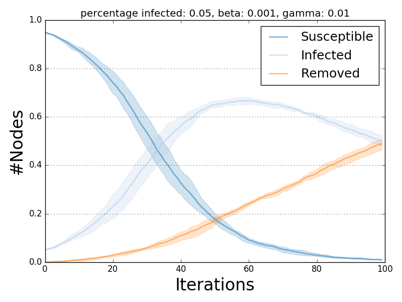

*************************
Model Multiple Executions
*************************

``dlib.utils.multi_runs`` allows the parallel execution of multiple instances of a given model starting from different initial infection conditions.

The initial infected nodes for each instance of the model can be specified either:

- by the "fraction_infected" model parameter, or
- explicitly through a list of ``n`` sets of nodes (where ``n`` is the number of executions required).

In the first scenario "fraction_infected" nodes will be sampled independently for each model execution.

Results of ``dlib.utils.multi_runs`` can be feed directly to all the visualization facilities exposed by ``ndlib.viz``.

.. autofunction:: ndlib.utils.multi_runs(model, execution_number, iteration_number, infection_sets, nprocesses)

-------
Example
-------

**Randomly selection of initial infection sets**

.. code-block:: python

    import networkx as nx
    import ndlib.models.ModelConfig as mc
    import ndlib.models.epidemics as ep
    from ndlib.utils import multi_runs

    # Network topology
    g = nx.erdos_renyi_graph(1000, 0.1)

    # Model selection
    model1 = ep.SIRModel(g)

    # Model Configuration
    config = mc.Configuration()
    config.add_model_parameter('beta', 0.001)
    config.add_model_parameter('gamma', 0.01)
    config.add_model_parameter("fraction_infected", 0.05)
    model1.set_initial_status(config)

    # Simulation multiple execution
    trends = multi_runs(model1, execution_number=10, iteration_number=100, infection_sets=None, nprocesses=4)

**Specify initial infection sets**

.. code-block:: python

    import networkx as nx
    import ndlib.models.ModelConfig as mc
    import ndlib.models.epidemics as ep
    from ndlib.utils import multi_runs

    # Network topology
    g = nx.erdos_renyi_graph(1000, 0.1)

    # Model selection
    model1 = ep.SIRModel(g)

    # Model Configuration
    config = mc.Configuration()
    config.add_model_parameter('beta', 0.001)
    config.add_model_parameter('gamma', 0.01)
    model1.set_initial_status(config)

    # Simulation multiple execution
    infection_sets = [(1, 2, 3, 4, 5), (3, 23, 22, 54, 2), (98, 2, 12, 26, 3), (4, 6, 9) ]
    trends = multi_runs(model1, execution_number=2, iteration_number=100, infection_sets=infection_sets, nprocesses=4)

**Plot multiple executions**

The ``ndlib.viz.mpl`` package offers support for visualization of multiple runs.

In order to visualize the average trend/prevalence along with its inter-percentile range use the following pattern (assuming ``model1`` and ``trends`` be the results of the previous code snippet).

.. code-block:: python

	from ndlib.viz.mpl.DiffusionTrend import DiffusionTrend
	viz = DiffusionTrend(model1, trends)
	viz.plot("diffusion.pdf", percentile=90)

where ``percentile`` identifies the upper and lower bound (e.g. setting it to 90 implies a range 10-90).

The same pattern can be also applied to comparison plots.

   Multiple run visualization.
