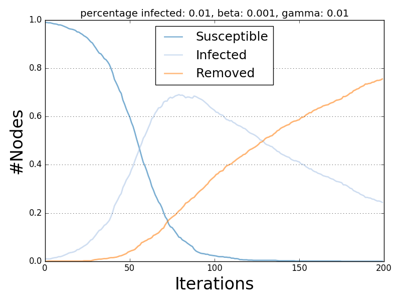

***************
Diffusion Trend
***************

The Diffusion Trend plot compares the trends of all the statuses allowed by the diffusive model tested.

Each trend line describes the variation of the number of nodes for a given status iteration after iteration. 

.. autoclass:: ndlib.viz.mpl.DiffusionTrend.DiffusionTrend
.. automethod:: ndlib.viz.mpl.DiffusionTrend.DiffusionTrend.__init__(model, trends)
.. automethod:: ndlib.viz.mpl.DiffusionTrend.DiffusionTrend.plot(filename, percentile)

Below is shown an example of Diffusion Trend description and visualization for the SIR model.

.. code-block:: python

    import networkx as nx
    import ndlib.models.ModelConfig as mc
    import ndlib.models.epidemics as ep
    from ndlib.viz.mpl.DiffusionTrend import DiffusionTrend

    # Network topology
    g = nx.erdos_renyi_graph(1000, 0.1)

    # Model selection
    model = ep.SIRModel(g)

    # Model Configuration
    cfg = mc.Configuration()
    cfg.add_model_parameter('beta', 0.001)
    cfg.add_model_parameter('gamma', 0.01)
    cfg.add_model_parameter("fraction_infected", 0.01)
    model.set_initial_status(cfg)

    # Simulation execution
    iterations = model.iteration_bunch(200)
    trends = model.build_trends(iterations)

    # Visualization
    viz = DiffusionTrend(model, trends)
    viz.plot("diffusion.pdf")

   SIR Diffusion Trend Example.
