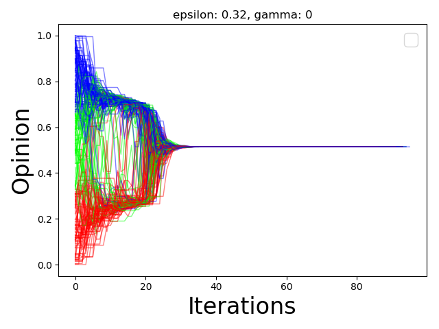

*****************
Opinion Evolution
*****************

The Opinion Evolution plot shows the node-wise opinion evolution in a continuous states model.

.. autoclass:: ndlib.viz.mpl.OpinionEvolution.OpinionEvolution
.. automethod:: ndlib.viz.mpl.OpinionEvolution.OpinionEvolution.__init__(model, trends)
.. automethod:: ndlib.viz.mpl.OpinionEvolution.OpinionEvolution.plot(filename)

Below is shown an example of Opinion Evolution description and visualization for the Algorithmic Bias model.

.. code-block:: python

    import networkx as nx
    import ndlib.models.ModelConfig as mc
    import ndlib.models.opinions as op
    from ndlib.viz.mpl.OpinionEvolution import OpinionEvolution

    # mMean field scenario
    g = nx.complete_graph(100)

    # Algorithmic Bias model
    model = op.AlgorithmicBiasModel(g)

    # Model configuration
    config = mc.Configuration()
    config.add_model_parameter("epsilon", 0.32)
    config.add_model_parameter("gamma", 0)
    model.set_initial_status(config)

    # Simulation execution
    iterations = model.iteration_bunch(100)

    viz = OpinionEvolution(model, iterations)
    viz.plot("opinion_ev.pdf")

   SIR Diffusion Trend Example.
