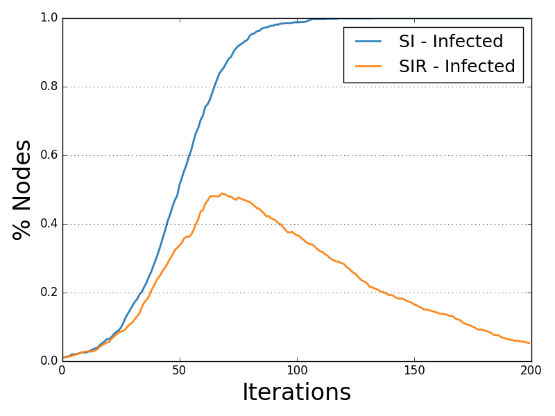

**************************
Diffusion Trend Comparison
**************************

The Diffusion Trend Comparison plot compares the trends of all the statuses allowed by the diffusive model tested.

Each trend line describes the variation of the number of nodes for a given status iteration after iteration.

.. autoclass:: ndlib.viz.mpl.TrendComparison.DiffusionTrendComparison
.. automethod:: ndlib.viz.mpl.TrendComparison.DiffusionTrendComparison.__init__(models, trends, statuses)
.. automethod:: ndlib.viz.mpl.TrendComparison.DiffusionTrendComparison.plot(filename, percentile)

Below is shown an example of Diffusion Trend description and visualization for the SIR model.

.. code-block:: python

    import networkx as nx
    import ndlib.models.ModelConfig as mc
    import ndlib.models.epidemics as ep
    from ndlib.viz.mpl.TrendComparison import DiffusionTrendComparison

    # Network topology
    g = nx.erdos_renyi_graph(1000, 0.1)

    # Model selection
    model = ep.SIRModel(g)

    # Model Configuration
    cfg = mc.Configuration()
    cfg.add_model_parameter('beta', 0.001)
    cfg.add_model_parameter('gamma', 0.01)
    cfg.add_model_parameter("fraction_infected", 0.01)
    model.set_initial_status(cfg)

    # Simulation execution
    iterations = model.iteration_bunch(200)
    trends = model.build_trends(iterations)

    # 2° Model selection
    model1 = ep.SIRModel(g)

    # 2° Model Configuration
    cfg = mc.Configuration()
    cfg.add_model_parameter('beta', 0.001)
    cfg.add_model_parameter('gamma', 0.02)
    cfg.add_model_parameter("fraction_infected", 0.01)
    model1.set_initial_status(cfg)

    # 2° Simulation execution
    iterations = model1.iteration_bunch(200)
    trends1 = model1.build_trends(iterations)

    # Visualization
    viz = DiffusionTrend([model, model1], [trends, trends1])
    viz.plot("trend_comparison.pdf")

   SIR-SI Diffusion Trend Comparison Example.
